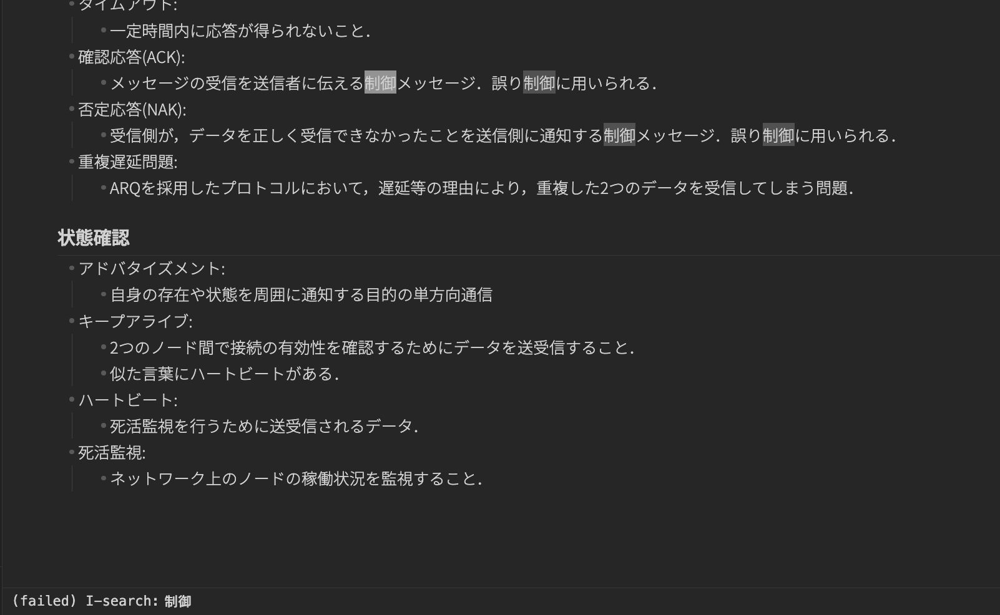

# Isearch and Mark

This plugin brings Emacs-style keybindings to Obsidian, focusing on incremental search (Isearch) and mark/region operations.

EmacsスタイルのキーバインドをObsidianに追加するプラグインです。
インクリメンタル検索とマーク・リージョン操作を提供します。
yankやkillはOSのクリップボードを使用します。

## Commands and Emacs keybindings

Emacs default keybindings and their corresponding commands.
Key assignments must be configured manually in Obsidian.
To use mark and region functionality, assign movement commands (e.g. Backward char, Forward char) to keys such as `C-f`, `C-b`, etc.

以下はEmacsのデフォルトキーバインドと，対応するコマンド一覧です。
ホットキーは手動で設定してください．
マーク・リージョン機能を使うには，移動コマンド（Backward char，Forward charなど）を `C-f`，`C-b` 等に割り当てる必要があります．

### Cursor movement

| Command             | Emacs key |
| ------------------- | --------- |
| Forward char        | `C-f`     |
| Backward char       | `C-b`     |
| Next line           | `C-n`     |
| Previous line       | `C-p`     |
| Beginning of line   | `C-a`     |
| End of line         | `C-e`     |
| Beginning of buffer | `M-<`     |
| End of buffer       | `M->`     |
| -------------       | --------- |
| Forward word        | `M-f`     |
| Backward word       | `M-b`     |

### Mark / region

| Command                    | Emacs key |
| -------------------------- | --------- |
| Set mark                   | `C-SPC`   |
| Keyboard quit (clear mark) | `C-g`     |

### Kill / yank

| Command            | Emacs key |
| ------------------ | --------- |
| Copy region        | `M-w`     |
| Kill region        | `C-w`     |
| Kill line          | `C-k`     |
| Kill word          | `M-d`     |
| Backward kill word | `M-DEL`   |
| Yank               | `C-y`     |

### Incremental search

| Command          | Emacs key |
| ---------------- | --------- |
| Isearch forward  | `C-s`     |
| Isearch backward | `C-r`     |
